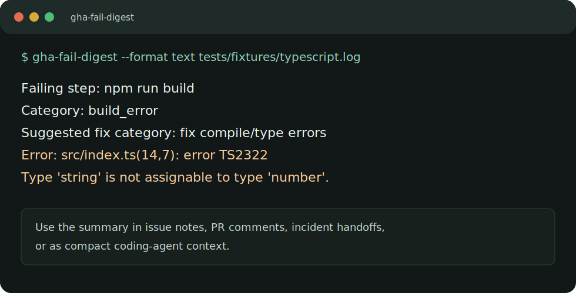

# gha-fail-digest

Local CLI for summarizing failed GitHub Actions logs into compact JSON or text.

`gha-fail-digest` is built for developers and coding agents that need the useful
part of a CI failure without pasting thousands of log lines into an issue,
pull request, incident note, or agent prompt.



## What It Does

- reads local `.log` and `.txt` files
- reads directories of logs
- reads downloaded GitHub Actions log ZIPs
- reads stdin
- can download logs from a GitHub Actions run URL
- extracts the failing step, category, primary error, stack trace, and context
- outputs JSON for automation, text for quick human triage, or Markdown for issue comments and agent handoff
- handles GitHub `::error` annotation messages

It does not call any AI API, collect telemetry, or send local logs anywhere.
URL mode talks only to GitHub's API from your machine.

## Quick Start

```bash
git clone https://github.com/YOUR-ACCOUNT/gha-fail-digest.git
cd gha-fail-digest
python3 -m venv .venv
. .venv/bin/activate
python -m pip install -e .
gha-fail-digest tests/fixtures/typescript.log
```

Text output:

```bash
gha-fail-digest --format text tests/fixtures/pytest.log
```

Markdown output for an issue, PR comment, or coding-agent handoff:

```bash
gha-fail-digest --format markdown tests/fixtures/jest.log
```

Stdin:

```bash
cat action.log | gha-fail-digest -
```

Downloaded GitHub Actions ZIP:

```bash
gha-fail-digest logs.zip
```

GitHub Actions run URL:

```bash
export GITHUB_TOKEN=github_pat_or_fine_grained_token
gha-fail-digest https://github.com/OWNER/REPO/actions/runs/123456789
```

`GITHUB_TOKEN` is only needed when GitHub requires authentication to fetch the
logs. Local files, ZIPs, directories, and stdin require no credentials.

## Example

```bash
gha-fail-digest --format text tests/fixtures/jest.log
```

```text
Failing step: npm test
Category: test_failure
Suggested fix category: fix failing tests
Error: expect(received).toEqual(expected)

Stack trace:
  at Object.<anonymous> (src/cart.test.ts:17:21)
```

JSON output includes every detected failure:

```json
{
  "category": "build_error",
  "error_message": "src/index.ts(14,7): error TS2322: Type 'string' is not assignable to type 'number'.",
  "failing_step_name": "npm run build",
  "source_count": 1,
  "suggested_fix_category": "fix compile/type errors"
}
```

## Good Agent Prompt

After parsing a failed run, paste this into a coding agent:

```text
Fix the GitHub Actions failure below. Start by reading the files referenced in
the error and run the narrowest test/build command that reproduces it.

<gha-fail-digest output here>
```

See [docs/agent-handoff.md](docs/agent-handoff.md) for a fuller template.

## Categories

Current categories are intentionally simple:

- `test_failure`
- `build_error`
- `lint_error`
- `dependency_error`
- `unknown_failure`
- `no_failure_detected`

## Validate Locally

```bash
PYTHONPATH=src python -m unittest discover -s tests
python -m compileall src tests
python scripts/verify_public_repo.py
```

An optional GitHub Actions CI template is included at
[docs/github-actions-ci.yml](docs/github-actions-ci.yml).

## Privacy Notes

- Local file, ZIP, directory, and stdin inputs stay on your machine.
- GitHub run URL mode uses GitHub's official logs endpoint from your machine.
- No telemetry is collected.
- No third-party AI API is used.
- Do not paste private logs into public issues. Reproduce with sanitized snippets.

## Limitations

- This is a heuristic parser, not a full CI observability product.
- It chooses the earliest high-signal failure as the primary failure.
- It does not understand every test runner or stack trace format yet.
- GitHub log URL mode depends on GitHub log retention and permissions.

## Roadmap

- SARIF-style output
- confidence scores for multiple candidate failures
- richer dependency/install failure detection
- optional team rules file for custom classifications

## License

MIT.
